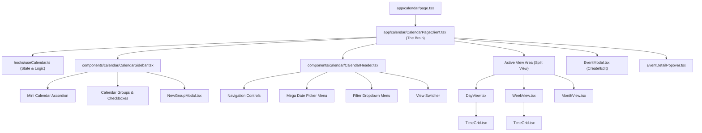

# Microsoft Teams Calendar Architecture

This document provides a high-level overview of the calendar implementation, its component structure, and state management flow for your senior review.

## Core Architecture
The calendar is built as a **Single Page Application (SPA)** within the Next.js `/calendar` route. It uses a **Centralized Hook-based state management** pattern.

### Component Tree Structure

### Key Technologies
- **Next.js 15 (App Router)**: Framework and routing.
- **Tailwind CSS v4**: Styling and design system.
- **Base UI (@base-ui/react)**: Unstyled accessible primitives for Popovers, Dropdowns, Accordions, and Dialogs.
- **Dayjs**: Date manipulation and formatting.
- **Lucide React**: Iconography.

---

## 🏗️ Component Structure

### 1. Orchestration Layer
- **[app/calendar/page.tsx](file:///c:/Users/dakur/Desktop/communication_module/app/calendar/page.tsx)**: The main entry point. It renders the [CalendarPageClient](file:///c:/Users/dakur/Desktop/communication_module/app/calendar/CalendarPageClient.tsx#15-157).
- **[app/calendar/CalendarPageClient.tsx](file:///c:/Users/dakur/Desktop/communication_module/app/calendar/CalendarPageClient.tsx)**: The "Brain" of the UI. It consumes the [useCalendar](file:///c:/Users/dakur/Desktop/communication_module/hooks/useCalendar.ts#9-154) hook and coordinates the sidebar, header, and active views.

### 2. State Management Strategy
Instead of complex global stores like Redux or Zustand, we use a **High-Performance Custom Hook Pattern**:
- **Source of Truth**: [hooks/useCalendar.ts](file:///c:/Users/dakur/Desktop/communication_module/hooks/useCalendar.ts) holds all state (dates, events, selected calendars).
- **Orchestration**: [CalendarPageClient.tsx](file:///c:/Users/dakur/Desktop/communication_module/app/calendar/CalendarPageClient.tsx) calls this hook once at the top level.
- **Data Flow**: State and functions are passed down to child components via **Props** (Prop Drilling). This keeps the components "pure" and easy to test, while avoiding the overhead of a global store for a feature-specific page.
- **Reactivity**: When the hook state changes (e.g., a checkbox is clicked), [CalendarPageClient](file:///c:/Users/dakur/Desktop/communication_module/app/calendar/CalendarPageClient.tsx#15-157) re-renders, and the new data flows down to the sidebar and views instantly.

### 3. Navigation & Sidebar
- **[CalendarSidebar.tsx](file:///c:/Users/dakur/Desktop/communication_module/components/calendar/CalendarSidebar.tsx)**:
  - Mini-calendar with month navigation (now inside an Accordion).
  - Checkable list of calendars and groups.
  - Triggers the [NewGroupModal](file:///c:/Users/dakur/Desktop/communication_module/components/calendar/NewGroupModal.tsx#12-121).
- **[CalendarHeader.tsx](file:///c:/Users/dakur/Desktop/communication_module/components/calendar/CalendarHeader.tsx)**:
  - Toolbar for navigation (Prev, Today, Next).
  - **Mega Date Picker**: A complex 2-pane month/year selector.
  - **Filter Applied**: A multi-select dropdown for event types.
  - View Switcher: Dropdown to toggle between Day, Week, and Month.

### 4. Calendar Views
- **[TimeGrid.tsx](file:///c:/Users/dakur/Desktop/communication_module/components/calendar/TimeGrid.tsx)**: The foundational component for all time-based views. It handles the 24-hour axis and grid lines.
- **[DayView.tsx](file:///c:/Users/dakur/Desktop/communication_module/components/calendar/DayView.tsx)**, **[WeekView.tsx](file:///c:/Users/dakur/Desktop/communication_module/components/calendar/WeekView.tsx)**, **[WorkWeekView.tsx](file:///c:/Users/dakur/Desktop/communication_module/components/calendar/WorkWeekView.tsx)**:
  - These use [TimeGrid](file:///c:/Users/dakur/Desktop/communication_module/components/calendar/TimeGrid.tsx#35-206) to render columns.
  - **Split View Logic**: If multiple calendars are selected, these components render one column per calendar side-by-side.
- **[MonthView.tsx](file:///c:/Users/dakur/Desktop/communication_module/components/calendar/MonthView.tsx)**: A 7-column grid showing the entire month with event overflow handling.

### 5. Modals & Popovers
- **[EventModal.tsx](file:///c:/Users/dakur/Desktop/communication_module/components/calendar/EventModal.tsx)**: Teams-style event creation with a split-pane layout (Form + Scheduler preview).
- **[EventDetailPopover.tsx](file:///c:/Users/dakur/Desktop/communication_module/components/calendar/EventDetailPopover.tsx)**: Quick view of event details with RSVP and Edit/Delete options.
- **[NewGroupModal.tsx](file:///c:/Users/dakur/Desktop/communication_module/components/calendar/NewGroupModal.tsx)**: Detailed modal for creating custom calendar groups.

---

## 🔄 Data & State Flow

1. **Selection**: User clicks a checkbox in [CalendarSidebar](file:///c:/Users/dakur/Desktop/communication_module/components/calendar/CalendarSidebar.tsx#44-226).
2. **State Update**: `toggleCalendar(id)` is called in [useCalendar](file:///c:/Users/dakur/Desktop/communication_module/hooks/useCalendar.ts#9-154), updating the `selectedCalendars` array.
3. **Re-render**: [CalendarPageClient](file:///c:/Users/dakur/Desktop/communication_module/app/calendar/CalendarPageClient.tsx#15-157) detects the state change.
4. **Split Logic**:
   - In [DayView](file:///c:/Users/dakur/Desktop/communication_module/components/calendar/DayView.tsx#15-78), it generates $N$ columns for $N$ selected calendars.
   - In [Week](file:///c:/Users/dakur/Desktop/communication_module/components/calendar/WeekView.tsx#14-56)/[Month](file:///c:/Users/dakur/Desktop/communication_module/components/calendar/MonthView.tsx#15-104) views, it maps over `selectedCalendars` to render $N$ horizontal grids.
5. **Filtering**: Events are filtered globally so only events belonging to `selectedCalendars` are passed to the View components.

---

## 🛠️ Specialized Logic
- **Real-time Indicator**: [TimeGrid](file:///c:/Users/dakur/Desktop/communication_module/components/calendar/TimeGrid.tsx#35-206) includes a `useEffect` ticker that updates a "red line" to show the current time, adjusted by height/pixels relative to the 24-hour day.
- **Mega Picker Sync**: The header's large date picker calls `onDateSelect`, which updates `currentDate` globally, immediately refreshing all views.
