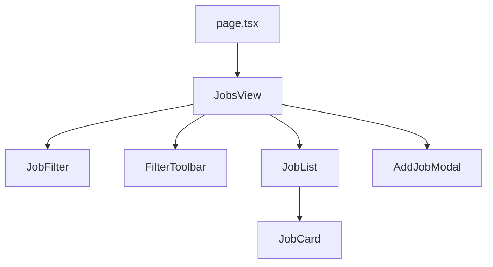

# Application Flow: Jobs Feature

This document explains the architecture and data flow of the Jobs management feature, designed for a high-level overview for senior developers.

## 1. High-Level Architecture

The application is built with **Next.js 15 (App Router)** and uses **Redux Toolkit** for global state management. It follows a **Feature-Based Architecture**, where logic related to "jobs" is encapsulated within `src/features/jobs`.

## 2. Component Hierarchy

The entry point for the jobs page is [page.tsx](file:///c:/Users/dakur/Desktop/aptagrim/src/app/(protected)/jobs/page.tsx), which renders the `JobsView` container.



- **JobsView**: The "Smart Component" or Container. It connects to Redux, selects state (jobs, search term, status), and passes data/handlers down to child components.
- **JobFilter**: Renders status tabs (Active, Paused, etc.) and triggers status change actions.
- **JobList**: Iterates over filtered jobs and renders `JobCard` components.
- **AddJobModal**: Handle the creation of new job listings.

## 3. Data Flow: Filtering Logic

The filtering flow demonstrates how UI interactions sync with the global state and re-render the view.

1.  **User Trigger**: User clicks a status in `JobFilter`.
2.  **Dispatch**: `JobFilter` calls `onStatusChange`, which dispatches `setSelectedStatus` (from `searchSlice`).
3.  **State Update**: Redux updates `state.search.selectedStatus`.
4.  **Re-render**: `JobsView` detects the state change via `useAppSelector`.
5.  **Memoized Filter**: `JobsView` recalculates `filteredJobs` using the `filterJobs` utility:
    ```typescript
    const filteredJobs = useMemo(
      () => filterJobs(jobs, searchTerm, selectedStatus),
      [jobs, searchTerm, selectedStatus]
    );
    ```
6.  **UI Update**: `JobList` receives the new `filteredJobs` prop and updates the UI.

## 4. Data Flow: Adding a Job

1.  **Input**: The user fills out the form in `AddJobModal`.
2.  **Submit**: On submission, `onSubmit` is called in `JobsView`.
3.  **Preparation**: `JobsView` generates a new ID and constructs a `Job` object.
4.  **Dispatch**: `dispatch(addJob(newJob))` is called (from `jobsSlice`).
5.  **State Persistent**: The new job is pushed into the `jobs` array in the Redux store.
6.  **Closure**: The modal is closed (`setIsModalOpen(false)`).

## 5. State Management Structure

Two Redux slices handle the jobs feature:

- **jobsSlice**: Manages the source of truth for all job data (`jobs` array), loading states, and CRUD operations.
- **searchSlice**: Manages the current UI filter state (`searchTerm` and `selectedStatus`).

This separation ensures that filtering logic (UI state) doesn't pollute the actual data (domain state).

## 6. Key Utilities

- **filterJobs**: Encapsulates the logic for matching jobs against search text and status filters.
- **generateJobId**: Ensures unique identifiers for new listings (e.g., `FLUO1J67`).
